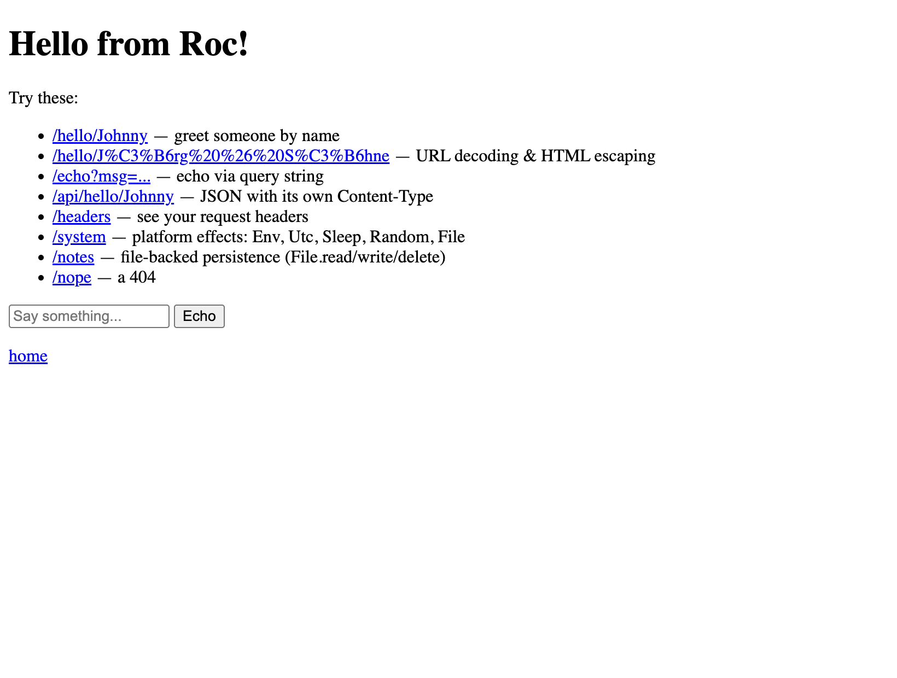
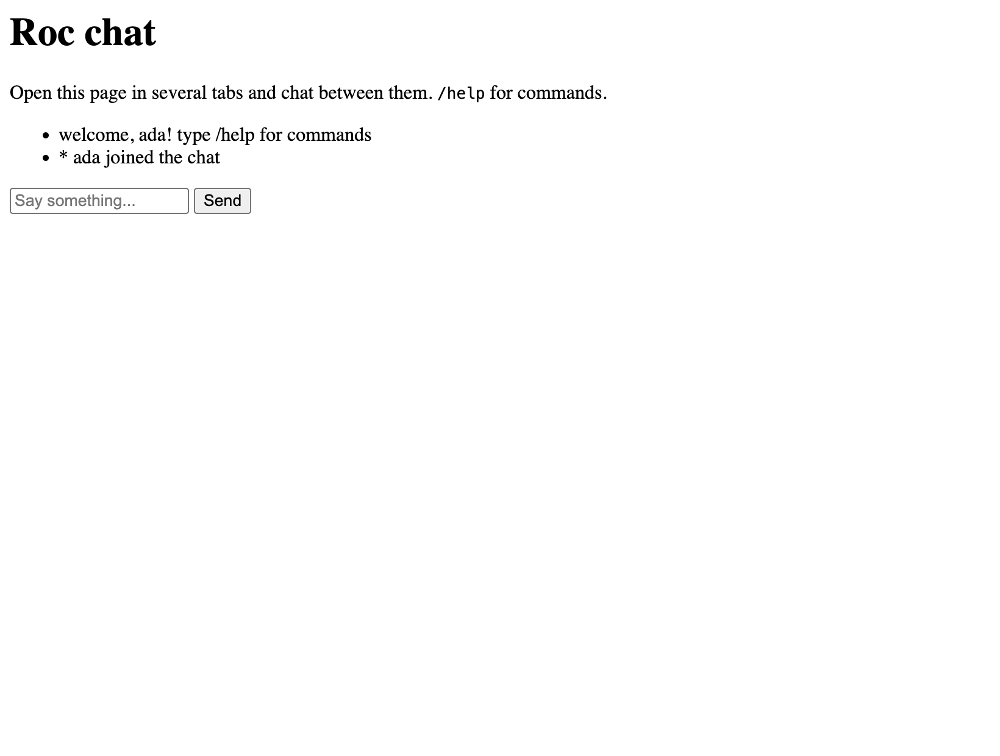

# roc-experimental-basic-webserver-zig

An **experimental port of [basic-webserver](https://github.com/roc-lang/basic-webserver)
to Roc's new Zig-based compiler**, with the host written in Zig.

> ⚠️ **This is a stop-gap, not a product.** It exists because I couldn't wait
> for the official basic-webserver to land on the new compiler. The official
> [basic-cli migration](https://github.com/roc-lang/basic-cli/tree/migrate-zig-compiler)
> is well underway (Rust host); basic-webserver's hasn't publicly started yet.
> The day it lands, this repo retires. Until then, it's a working data point.
>
> Built almost entirely by Fable, steered by a
> human who knows nothing about low-level programming. Judge accordingly. 🙂





## What it can do

- **Handler inversion**: the Zig host owns the TCP listener and a worker
  pool; your app just exports `handle! : Request => Response`
- **HTTP/1.1** with keep-alive, pipelining, HEAD/OPTIONS handling
- **WebSockets** (RFC 6455): handshake, frame loop, ping/pong keepalive, and
  server push — apps export `on_ws!` returning `{ broadcast, reply }`
- **basic-cli's module APIs, vendored verbatim**: `Stdout`, `Stderr`, `Env`,
  `Utc`, `Sleep`, `Random`, `File`, `Dir`, `Cmd` (+ `IOErr`), all returning
  proper `Try(T, [SomeErr(IOErr)])` values with errno mapping
- **roc-lang/http types**: the vendored `Request`/`Response`/`Method`
  modules from [roc-lang/http](https://github.com/roc-lang/http)
- Verified by a test battery: parallel-request floods, concurrent
  file-writing, WebSocket protocol tests, macOS `leaks` (0 leaks),
  graceful SIGINT shutdown

## What it can't do

- No TLS, no chunked transfer encoding, binds 127.0.0.1 only
- Calls into Roc are serialized behind one mutex (parallel I/O,
  sequential handlers) — fine for demos, not for production
- macOS arm64 only (the host is plain libc, so other targets are
  *probably* a build-matrix problem rather than a code problem)
- No `Stdin`/`Tty`/`Locale`/`Path` (server-irrelevant or deferred)

## Why a Zig host (when the official ports use Rust)?

The official basic-cli migration sensibly reuses its battle-tested Rust
crates. We started from zero with nothing to reuse, and from there a Zig
host is a remarkably good fit: it imports the compiler's **own builtins
module directly** (`RocStr`, `RocList`, `host_abi.hostedFn`) — no FFI
re-declarations, no `roc_std` layer, and one Zig toolchain builds
everything. Same goal (minimise friction), opposite starting point,
opposite conclusion.

## Quick start

Requirements:

- macOS on Apple Silicon (Intel *should* work too — see "Other targets")
- [Zig 0.16.0](https://ziglang.org/download/)
- The Roc compiler **built from source at commit `48b28c07`**, checked out
  as a sibling directory of this repo named `roc-48b28c07`
  (`build.zig.zon` points at `../roc-48b28c07`):

```sh
git clone https://github.com/roc-lang/roc roc-48b28c07
cd roc-48b28c07 && git checkout 48b28c07 && zig build
```

Then, from this repo:

```sh
./build.sh app          # build host + app, start server on port 8000
./build.sh chat 9000    # any example, optional port
```

Override tool paths with `ROC=/path/to/roc` and `ZIG=/path/to/zig`.
The `websocket-elm` example additionally needs [Elm 0.19](https://elm-lang.org).

> **Why a pinned compiler commit?** The new compiler is pre-release and its
> syntax/ABI still change weekly. Everything here is verified against
> exactly this pin. Nightlies exist at
> [roc-lang/nightlies](https://github.com/roc-lang/nightlies) and are the
> likely future pin source.

## Other targets (untested!)

The build system knows four targets (`arm64mac`, `x64mac`, `arm64musl`,
`x64musl`), but only **arm64mac** has ever actually been run.

**Intel Mac** — expected to work, never tested. The host cross-compiles
with zero errors and uses no architecture-specific code; `build.sh`
auto-detects the architecture, so the normal quick start applies as-is.
To produce the static library alone: `zig build x64mac` (lands in
`platform/targets/x64mac/libhost.a`). Reports welcome!

**Linux (musl)** — does not build yet, but the gap is small and known.
`zig build x64musl` currently fails on exactly three darwin-isms in
`platform/host.zig`:

1. `dirent.namlen` doesn't exist on Linux (use `strlen` of the
   null-terminated `name` instead) — two call sites
2. one errno-enum member name differs (`.OPNOTSUPP` arm of the
   `IOErr` mapping switch)
3. `_NSGetExecutablePath` would fail at link time
   (use `readlink("/proc/self/exe")`)

The musl target entries (including `crt1.o`/`libc.a`) are already declared
in `platform/main.roc`. If you port it, a PR would be very welcome.

## Examples

| Example | What it shows |
|---|---|
| `app` | HTTP routing, URL decoding + HTML escaping in Roc, JSON endpoint, `/system` (exercises **every** platform effect incl. File/Dir/Cmd roundtrips), `/notes` (file-backed persistence) |
| `ws-echo` | WebSocket echo with commands (`/upper`, `/reverse`, `/count`) |
| `chat` | Multi-tab broadcast chat over WebSocket server push |
| `websocket-elm` | The chat with an Elm frontend; the compiled bundle is embedded at build time via an ingested import — no runtime file I/O |

Tests: `python3 tests/test_ws_concurrent.py` (against `ws-echo`) and
`python3 tests/test_ws_chat.py` (against `chat`), with a server running.

## How it works (the short version)

```
┌─────────┐  accept   ┌──────────────┐  parse HTTP   ┌─────────────────┐
│ acceptor │ ───────▶ │ worker pool  │ ────────────▶ │ roc__handle     │
│ (poll)   │          │ (≤16 threads)│  Roc records  │ (interpreter,   │
└─────────┘          └──────────────┘ ◀──────────── │  one at a time) │
                            │            Response    └─────────────────┘
                            ▼
                     WebSocket frames ⇆ roc__ws_message + broadcast registry
```

The host (`platform/host.zig`, ~1600 lines) implements every effect with
plain libc: `getenv`/`getcwd`, `clock_gettime`, `nanosleep`,
`arc4random_buf`, `open`/`read`/`write`/`unlink`, `mkdir`/`opendir`/
`readdir`, and `posix_spawnp` + pipes for `Cmd`. Errnos map to basic-cli's
`IOErr` tags; unmapped ones become `Other(strerror)`.

## ABI notes (possibly the most useful part)

Everything we learned about the new compiler's host ABI — record layouts,
tag-union (`Try`) layouts incl. nested ones, the silent-failure rules of
the hosted-function table, `RocStr`'s field order, ownership rules — is
written down in [IO-PORT-PLAN.md](IO-PORT-PLAN.md), and the full build
history (every round, every bug, every workaround) lives in
[CREATING-AN–EXPERIMENTAL–BASIC-WEBSERVER-new-compiler.md](CREATING-AN–EXPERIMENTAL–BASIC-WEBSERVER-new-compiler.md).
Layouts were verified empirically in both directions with a probe platform
before any real code relied on them.

## Licence & attribution

[UPL-1.0](LICENSE), matching the upstream projects. Vendored code:

- `platform/Method.roc`, `Request.roc`, `Response.roc` from
  [roc-lang/http](https://github.com/roc-lang/http) (`cc845a2`), pristine
  except one marked addition (`Method.from_str`)
- `platform/Env.roc`, `Utc.roc`, `Sleep.roc`, `Random.roc`, `IOErr.roc`,
  `File.roc`, `Dir.roc`, `Cmd.roc` API definitions from
  [roc-lang/basic-cli](https://github.com/roc-lang/basic-cli)
  (branch `migrate-zig-compiler`), signatures unchanged; `Cmd.roc` carries
  two marked adaptations for this compiler pin

Thanks to the Roc team — especially the basic-cli migration work by
Anton-4 and Luke Boswell, which served as the API blueprint.
